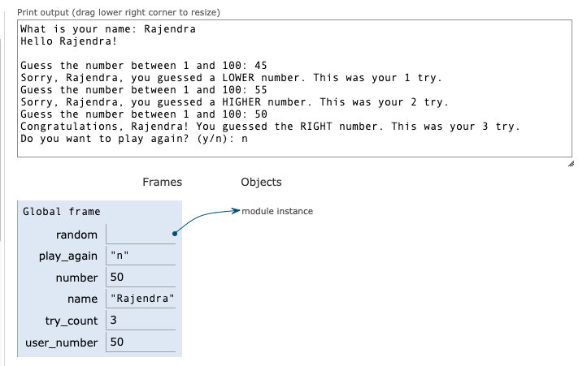

# Goal of the Code

The goal of this Python script is to implement an interactive **number guessing game** where:

- **Random Number Generation**: The program generates a random integer between 1 and 100 using the `random` module.
- **User Interaction**: It prompts the user to enter their name and then repeatedly guess the generated number.
- **Feedback Mechanism**: After each guess, the program provides feedback:
  - Informs the user if their guess is **too low**, **too high**, or **correct**.
  - Displays the number of attempts made so far.
- **Loop Control**: The guessing continues in a loop until the user correctly guesses the number.
- **Completion Message**: Upon a correct guess, the program congratulates the user and displays the total number of tries it took to guess the number correctly.
- **Error Handling for Non-integer Inputs:**
We wrap the input conversion and the subsequent code in a `try` block to catch `ValueError` exceptions, which occur if the user enters a non-integer value.

This game combines user input, random number generation, conditional statements, and loops to create an engaging and interactive experience.

- **Code test and visulization** 
Visit https://pythontutor.com/
